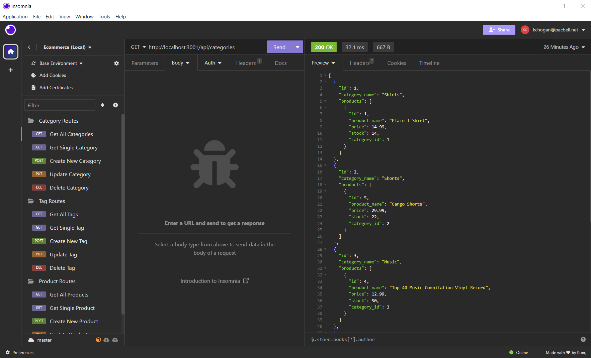

# E-commerce Backend

[](https://opensource.org/licenses/MIT)

## Description
The back end for an e-commerce site using Express.js API and Sequelize to interact with a MySQL database.  

## Table of Contents

- [Installation](#installation)
- [Usage](#usage)
- [Credits](#credits)
- [License](#license)
- [How to Contribute](#guidelines)
- [Tests](#tests)
- [Questions](#questions)

## Installation

After cloning the repo
- Set up '.env' based on the provided example
- Type 'npm install'
- Use the database schema.sql file with MySQL to create the db
- Type 'npm seed' to populate the db

## Usage

- Type 'npm start' to run the application
- Use a browser, cURL, or a third party app (e.g. Insomnia) to run routes for GET, POST, PUT, and DELETE routes:
   - Categories
        - Return all categories: GET: http://localhost:3001/api/categories/
        - Return a single category: GET: http://localhost:3001/api/categories/:id
        - Create a category: POST: http://localhost:3001/api/categories/:id
            ```json
            {
                "category_name": "string"
            }
            ```
        - Update a category: POST: http://localhost:3001/api/categories/:id
        - Delete a categery: DELETE: http://localhost:3001/api/categories/:id
    - Tags
        - Return all tags: http://localhost:3001/api/tags
        - Return a single tag: GET: http://localhost:3001/api/tags/:id
        - Create a tag: POST: http://localhost:3001/api/tags/:id
            ```json
            {
                "tag_name": "string"
            }
            ```
        - Update a tag: POST: http://localhost:3001/api/tags/:id
        - Delete a tag: DELETE: http://localhost:3001/api/tags/:id
    - Products
        - Return all products: http://localhost:3001/api/products
        - Return a single product: GET: http://localhost:3001/api/products/:id
        - Create a product: POST: http://localhost:3001/api/products/:id
            ```json 
            {
                "product_name": "string",
                "price": 200.00,
                "stock": 3,
                "tagIds": [1, 2, 3, 4]
            }
            ```
        - Update a product: POST: http://localhost:3001/api/products/:id
        - Delete a product: DELETE: http://localhost:3001/api/products/:id
- Repo includes and Insomnia.JSON that contains all of the relevant API calls


[Demo Video](https://www.youtube.com/watch?v=q-3N93Op4s0)

## Credits

* Node.js Copyright [OpenJS Foundation](https://openjsf.org/) and Node.js contributors. All rights reserved. 
* MySQL is © 2024 Oracle
* Insomnia Copyright © 2024 Kong Inc. All Rights Reserved.
* Express.js Copyright © 2017 StrongLoop, IBM, and other expressjs.com contributors.
* Sequelize Copyright © 2024 Sequelize Contributors
* Dotenv Copyright (c) 2015, Scott Motte. All rights reserved.

## License

This application is covered under the MIT License.

<a id="guidelines"></a>
## How To Contribute

N/A

## Tests

N/A

## Questions

[GitHub Profile](https://github.com/kevinchogan)

For questions, please contact kchogan@pacbell.net.
